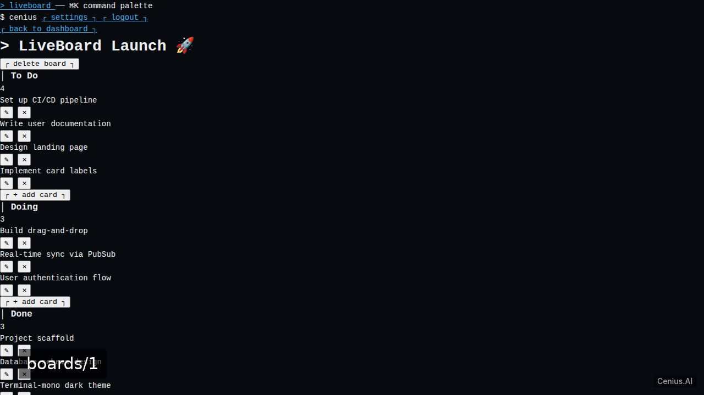
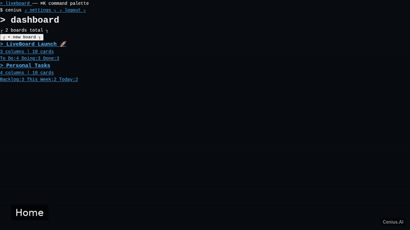
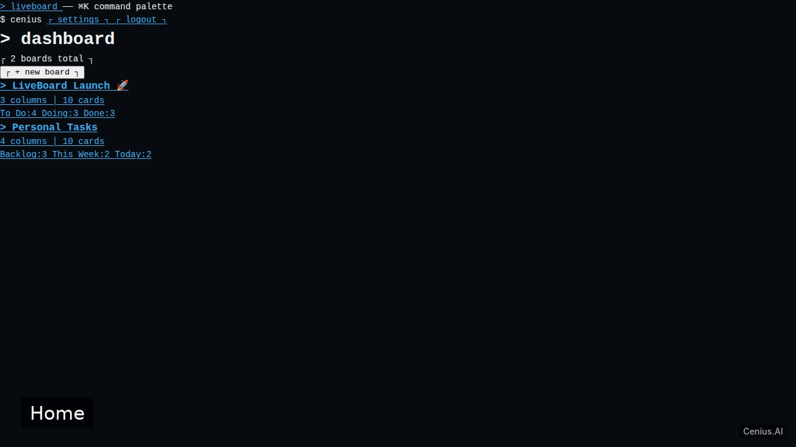
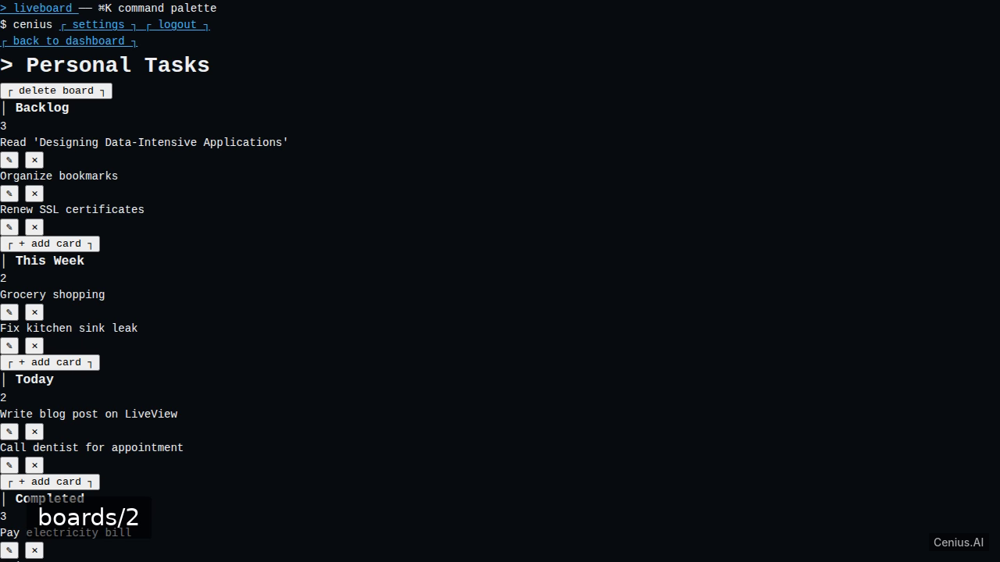

# LiveBoard — complete Elixir/Phoenix kanban board example app

**LiveBoard** is a free, open-source kanban board written in Elixir/Phoenix. Build a real-time collaborative kanban board application using Elixir Phoenix LiveView. Every LiveBoard file — code, design, seeded demo data — ships in this repository under the Apache-2.0 license. Self-host it, or [remix LiveBoard on cenius.ai](https://cenius.ai/marketplace/p/liveboard?ref=gh&utm_campaign=liveboard-phoenix) to get a custom build with full rebrand rights.


[](LICENSE)  [](https://cenius.ai)

[](https://cenius.ai/marketplace/p/liveboard?ref=gh&utm_campaign=liveboard-phoenix)

> **▶ [Open & edit in cenius.ai](https://cenius.ai/marketplace/p/liveboard?ref=gh&utm_campaign=liveboard-phoenix)** — one click to an editable workspace: describe changes in plain English, get an instant preview, one-click deploy and host. Modifications made on the platform come with full rebrand & relicense rights.

_Local clone? See [Quick start](#quick-start) below. cenius.ai is the zero-setup path._

## Demo





▶ **[See it in action](https://cenius.ai/marketplace/p/liveboard?ref=gh&utm_campaign=liveboard-phoenix)** — full demo on the project page · [MP4](.github/media/demo.mp4)

## Screenshots

  

## Architecture

Open the repo and you'll find a complete Elixir/Phoenix application (71 files). Top-level layout: `assets/`, `config/`, `lib/`, `priv/`, `test/`. `install.sh` wires up dependencies and loads seed records; after it runs the app has real data to show. Step-by-step setup guide: [`INSTALL.md`](INSTALL.md).

## Quick start

```bash
./install.sh   # installs dependencies + seeds demo data
```

See [`INSTALL.md`](INSTALL.md) for full setup and usage instructions.

## Usage guide

Once the server is running (`mix phx.server`), open `http://localhost:4000` in your browser.

### User Registration and Login

- **Sign Up** – Click the "Register" link on the home page and fill in your email and password.
- **Log In** – Use the credentials you created to access the application.
- After logging in, you are redirected to your dashboard.

The seeded demo account (if you ran `mix setup`) uses the credentials:
- Email: `demo@example.com`  
- Password: `password1234`

### Dashboard

The dashboard (`/` or `/dashboard`) lists all boards belonging to you. Click any board title to open its detail view.

### Board Detail

Inside a board, you will see three default columns: **To Do**, **Doing**, and **Done**.

- **Add a Column** – Use the "+ Add Column" button, type a name, and submit.
- **Add a Card** – Inside any column, click "+ Add Card", enter a title, and press Enter or click the add button.
- **Drag & Drop** – Grab a card and drag it to another column. The move is instantly reflected for all viewers of the board.
- **Edit/Delete** – Cards can be edited or deleted using the icons that appear on hover.

All changes (card creation, movement, deletion, column additions) are broadcast in real time using Phoenix LiveView. Open the same board in another browser window or incognito tab to see live updates.

### Settings

Click your username (or user icon) in the navigation bar and select "Settings" to:
- Update your email or password.
- Delete your account.

### Additional Notes

_Full guide: [`USAGE.md`](USAGE.md)_

## FAQ

### How do I self-host LiveBoard?

`git clone` + `./install.sh` gets you a running instance — the install script provisions dependencies and demo data. Full steps live in [`INSTALL.md`](INSTALL.md); nothing external is needed to try it.

### Is white-labeling LiveBoard allowed?

Rebranding is straightforward under the MIT license — change what you want in the source. Or [open it on cenius.ai](https://cenius.ai/marketplace/p/liveboard?ref=gh&utm_campaign=liveboard-phoenix): the platform handles the changes and grants full rebrand rights on the result.

### Which technology stack does LiveBoard use?

The app is built with Elixir/Phoenix. What you see in this repo is the full production source, demo data included.

### Is there a no-code way to modify LiveBoard?

[cenius.ai](https://cenius.ai/marketplace/p/liveboard?ref=gh&utm_campaign=liveboard-phoenix) handles the implementation. Tell it what you want in everyday words, pick up the updated build. No coding needed.

### What license does LiveBoard use?

Confirmed free for commercial use — MIT terms let you incorporate, resell, or ship it in any product. [LICENSE](LICENSE).

## License & rebranding

Released under the [Apache License 2.0](LICENSE) (© 2026 Cenius AI) — free for personal and commercial use. The Cenius name/logo are trademarks (see NOTICE).

**Need a customized version?** [Remix this app on cenius.ai](https://cenius.ai/marketplace/p/liveboard?ref=gh&utm_campaign=liveboard-phoenix) — modifications made on the platform come with **full rebrand & relicense rights** over your derivative.

## Built with cenius.ai

This entire application — code, design, seeded demo data — was generated on **[cenius.ai](https://cenius.ai)** from a plain-English description.

- 🚀 [Build your own app on cenius.ai](https://cenius.ai)
- 🎛️ [Remix LiveBoard on the marketplace](https://cenius.ai/marketplace/p/liveboard?ref=gh&utm_campaign=liveboard-phoenix) — open it in a workspace, prompt for changes, and ship your own version.

More open-source apps: [the Cenius-ai catalog](https://github.com/Cenius-ai) · [showcase index](https://github.com/Cenius-ai/showcase)
